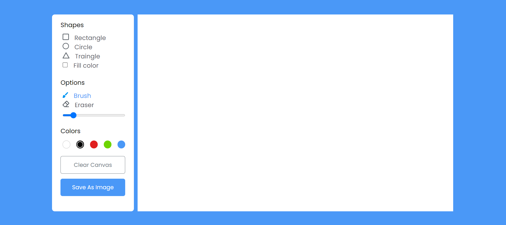

<h1 align='center'>Drawing App </h1>
In this drawing app, you can draw different shapes like rectangles, circles, and triangles in their preferred colors. You can also erase or download your drawing as an image. All these functionalities are done with HTML 5 canvas & vanilla JavaScript, no external framework or library is used.

<h2>ScreenShots</h2>

